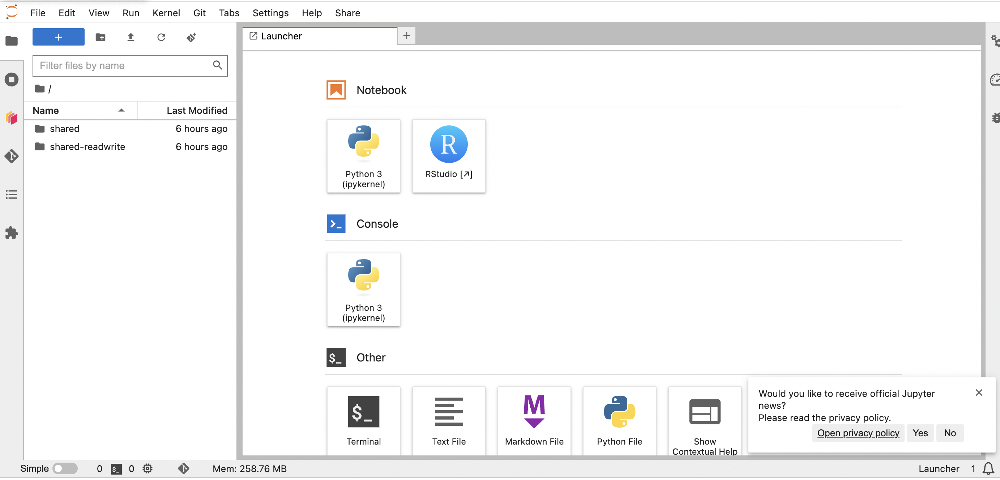
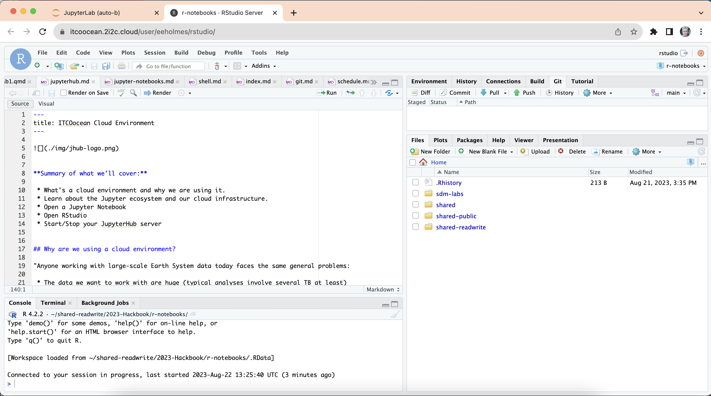
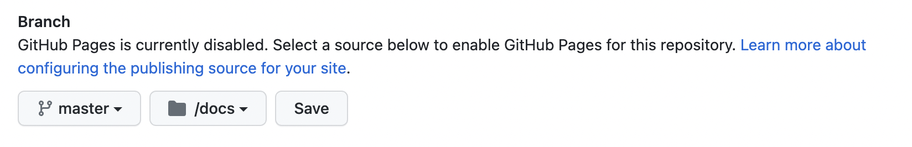

::: {.callout-note icon="false"}
## Goals

In this lab, you will learn how to

-   import a GitHub repository = make a copy of a repository in your own account
-   clone GitHub repositories to RStudio = get the repo into RStudio
-   set up authentication so you can push up changes
:::

## Import a GitHub repository

1. In your browser, navigate to <https://github.com/nmfs-opensci/Quarto-Website>
2. Copy the URL
3. Click on the "+" in the top right (on GitHub) and select "import repository"
4. Follow instructions to import to your GitHub account
5. Now you have your OWN copy of `Quarto-Website`
6. Copy the URL for your OWN copy. It will look like this
```
https://github.com/yourgithubusername/Quarto-Website
```

## Clone a GitHub repository into RStudio

1. Login to the JupyterHub. **You might have to wait awhile** for the page to load.
2. Click on the RStudio button when the Launcher appears

3. Click on the tab that opens with the R in a circle. You should see this

3. Click File > New Project > Version Control > Git
4. Paste the URL into the box
5. Click "Create Project"
6. The project is created and the Git tab appears in the upper right panel.

Congratulations! You **pulled** changes from GitHub into the JupyterHub!

## Let's explore the files

1. This happens to be a website. Let's **build** it using the Build tab in the upper right panel.
2. Click "Render Website". The website should build and appear.
  - If it doesn't open automatically, go to docs > index.html, right click and open that in a browser.
3. Open the `about.qmd` file. Let's edit that! You can use the "Source" or "Visual" editor.
4. When you have made some edits, click "Render" to see how it looks.
5. You can also click Build > Render Website to re-create the whole website.

## Set up authentication

You need to tell GitHub who you are so you can **push** your local changes up to GitHub. There are a few ways to do this. I am going to show you a way that works on any computer, including a virtual computer like the JupyterHub.

### Step 1: Generate a Personal Access Token

We are going to generate a **classic** token.

1. Go to https://github.com/settings/tokens
2. Click Generate new token > Generate new token (classic)
3. When the pop-up shows up, fill in a description, click the "repo" checkbox, and then scroll to bottom to click "Generate".
4. SAVE the token. You need it for the next step.

### Step 2: Tell Git who your are

1. Return to RStudio
2. Click the terminal tab in the bottom right panel
3. Paste these 3 lines of code into the terminal
```
git config --global user.email "<your email>"
git config --global user.name "<your name>"
git config --global pull.rebase false
git config --global credential.helper store
```

### Step 3: Push changes up to GitHub

1. Click the Git tab (upper right panel)
2. Click the checkboxes next to what changes you want to push
3. Click "Commit"
4. Fill out a comment and click "Commit"
5. Close the pop-ups
6. Click **Push**

[Full instructions with ways to do this from R](https://rverse-tutorials.github.io/RWorkflow-NWFSC-2022/set-up.html#Git_from_RStudio_Desktop)

## Optional: Make your website live!

*For those who get through all the steps and want to play around more.*

1. Go to your Quarto Website repository on Github
2. Go to Settings > Pages (in left navbar)
3. You need to select the branch and the folder where the webpage files are. In this case, they are in `docs`

4. The URL where your website will appear is shown.

*Have you noticed that people have personal websites at username.github.io? How did they do that? If you create a repo named username.github.io in GitHub, it will automatically appear with that URL. Look for a repo with that name in someone's GitHub account if you see that they use that as their personal website.*

