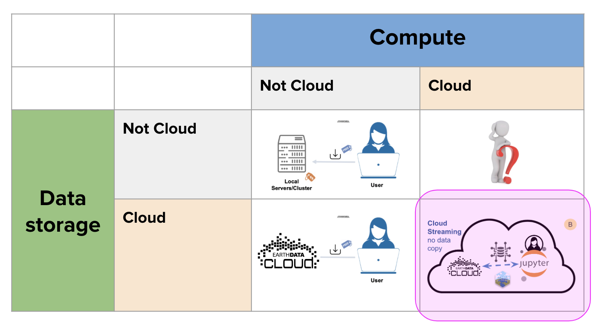

Register for the EDM Workshop: Go to [website](https://2024noaaedmw.sched.com/) with password EnterpriseData2024  Once registered you can navigate to Workshop 3B [Part I](https://2024noaaedmw.sched.com/event/1auQ5/3b-introduction-to-using-earth-data-in-the-cloud-for-scientific-workflows-180min-part-i) and [Part II](https://2024noaaedmw.sched.com/event/1auQi/3b-introduction-to-using-earth-data-in-the-cloud-for-scientific-workflows-180min-part-ii) and add them to your schedule. A couple prerequisites if you want to follow along with our tutorials during the workshop on our JupyterHub:

* Provide us your GitHub user name:  <https://forms.gle/9R1oavEw3mxWFmaF7>
* Questions? Submit questions here and we will get back to you: <https://forms.gle/LeWQVUHhhJ5sz1CJ7>

Note, access to our JupyterHub is restricted to those with a NOAA email. *What if I am non-NOAA?* You can watch or follow along on Google Colab. *What if I don’t have a GitHub user name?* You can sign up for a user name at www.github.com, just watch, or follow along on 
Google Colab. 

Welcome to the NOAA Fisheries workshop focused on geospatial analysis using ocean 'big data'. Today, we are focused on using data from NASA [EarthData](https://www.earthdata.nasa.gov/) but the skills you will learn are transferable to other ways that you might get earth data (e.g., NESDIS, NCEI, ERDDAP servers, Copernicus).

This workshop is focused on those who are brand new to working with earth data in the cloud and with geospatial packages. You will be introduced to cloud access to earth data via Python (first hour) and R (second hour). This workshop will also introduce working with [JupyterHubs](https://jupyter.org/hub). We will Jupyter Lab (Python) and RStudio (R) within our JupyterHub. 

[SCHEDULE](schedule.html) (see nav bar to left)

## Resources

* [CoastWatch GitHub organization](https://github.com/coastwatch-training) for many more training modules for working with satellite data in Python and R
* [NASA EarthData Cloudbook](https://nasa-openscapes.github.io/earthdata-cloud-cookbook/) for many tutorials on using satellite data in Python and R and NASA Earth Data
* [Project Pythia](https://cookbooks.projectpythia.org/)
* [IOOS Python Cookbooks](https://ioos.github.io/ioos_code_lab/content/code_gallery/gallery.html)
* [NMFS Friday HackHours](https://nmfs-opensci.github.io/NOAAHackDays/)
* [IOOS CodeLab](https://ioos.github.io/ioos_code_lab/content/intro.html) collection of tutorials and examples of how to access and utilize the many IOOS technologies and data sources available.

## Thank you for inspiration and content!

Thank you to the open science community that has created software, teaching resources, and workflows that we have been able to build off of and be inspired by. These include: 
[NASA Openscapes](https://nasa-openscapes.github.io) &bullet; 
[OceanHackWeek](https://oceanhackweek.org) &bullet; 
[SnowEx Hackweek](https://snowex.hackweek.io/) &bullet; 
[eScience Institute, University of Washington](https://guidebook.hackweek.io/intro.html) &bullet; 
[ICESat-2 Hackweek](https://icesat-2-2022.hackweek.io/) &bullet;
[Project Jupyter](https://jupyter.org/) &bullet; 
[Pangeo Project](https://pangeo.io/) &bullet; 
[CryoCloud](https://cryointhecloud.com/)
  

