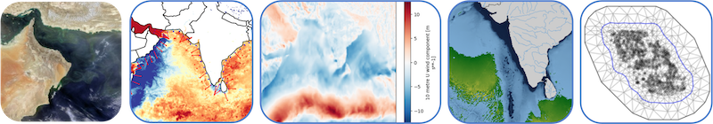

Welcome to the NOAA Fisheries workshop focused on geospatial analysis using ocean 'big data'. Today, we are focused on using data from NASA [EarthData](https://www.earthdata.nasa.gov/) but the skills you will learn are transferable to other ways that you might get earth data, e.g. NESDIS, NCEI, ERDDAP servers, Copernicus, etc.

This session will also introduce to working with JupyterHubs. We will use both Jupyter Lab (Python) and RStudio (R) within our JupyterHub. Go to [set-up](setup.html) for the basic orientation and how to get on the JupyterHub.

## Topics

* Introduction to working with earth data in the cloud and NASA Earth Data
* Orientation on our JupyterHub
* Tutorial 1: Searching for resources in NASA Earth Data
* Tutorial 2: Points and shapefiles
* Tutorial 3: Subsetting your earth data with in a region (shapefile)
* Tutorial 4: Getting values at points (along a track or transect)

## Resources

* [CoastWatch GitHub organization](https://github.com/coastwatch-training) for many more training modules for working with satellite data in Python and R
* [NASA EarthData Cloudbook](https://nasa-openscapes.github.io/earthdata-cloud-cookbook/) for many tutorials on using satellite data in Python and R and NASA Earth Data

