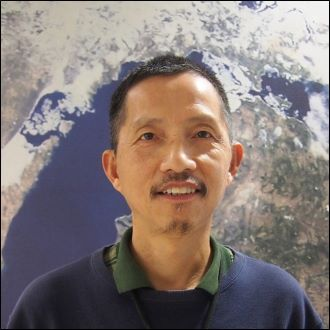
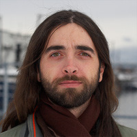

## Organizers and Instructors

### Eli Holmes

<!--
 {width=75% fig-alt="picture of Eli Holmes"}
-->

[NOAA Fisheries](https://www.fisheries.noaa.gov/)

[webpage](https://eeholmes.github.io/) &#x2022;  [GitHub](https://github.com/eeholmes)  &#x2022; [ORCID](https://orcid.org/0000-0001-9128-8393)

### Sunny Hospital
    

[NOAA CoastWatch PolarWatch](https://polarwatch.noaa.gov/)

[GitHub](https://github.com/shospital) 

### Matt Grossi

[NOAA Fisheries](https://www.fisheries.noaa.gov/)

[webpage](https://mattgrossi-noaa.github.io/) &#x2022;  [GitHub](https://github.com/mattgrossi-noaa)  &#x2022; [ORCID](https://orcid.org/0000-0002-8550-3189)

### Emily Markowitz

[NOAA Fisheries](https://www.fisheries.noaa.gov/)

[webpage](https://emilyhmarkowitz.github.io/emilyhmarkowitz) &#x2022;  [GitHub](https://github.com/EmilyMarkowitz-NOAA) &#x2022; [NOAA](https://www.fisheries.noaa.gov/contact/emily-markowitz) &#x2022; [ORCID](https://orcid.org/0000-0001-5757-4230)

### Songzhi Liu
    

    
[NOAA CoastWatch Great Lakes Node](https://coastwatch.glerl.noaa.gov/)

[webpage](https://sssliuum.github.io/)  &#x2022;
[GitHub](https://github.com/sssliuum) 

### Dan Pendleton

[NOAA Fisheries](https://www.fisheries.noaa.gov/)

[webpage](https://www.researchgate.net/profile/Daniel-Pendleton) &#x2022;  [GitHub](https://github.com/dep22) &#x2022; [ORCID](https://orcid.org/0000-0001-9341-8841)

### More

### More

